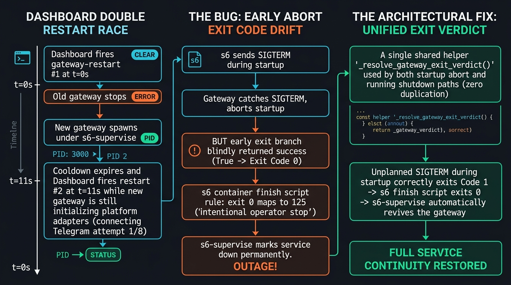

# Investigação & Solução #103191 — SIGTERM durante startup do Gateway e supervisor s6

Data da investigação: 2026-09-04  
Status: **Confirmado e corrigido.** A causa raiz foi unificada em `gateway/run.py` sem duplicação de lógica de saída, com cobertura completa de testes em `tests/gateway/test_startup_restart_race.py`.

---

## 1. Veredito

O problema relatado no issue **#103191** é **100% real e verificado no runtime e no código-fonte**.

Quando o gateway recebe um `SIGTERM` durante o processo de inicialização (`start_gateway()`, antes de setar `runner._running = True`), o tratador de sinal assíncrono marca `_signal_initiated_shutdown[0] = True` e aciona `runner.stop()`. O startup é abortado cooperativamente via `_abort_startup_if_shutdown_requested()`, caindo no bloco:

```python
if not runner._running:
    await runner.wait_for_shutdown()
    if _exit_with_failure_verdict(runner):
        return False
    with suppress(Exception):
        await _shutdown_mcp_servers_nonblocking()
    if runner.exit_code is not None:
        raise SystemExit(runner.exit_code)
    return True
```

Esse bloco retornava incondicionalmente `True`, fazendo `main()` calcular `exit_code = 0` e executar `_exit_after_graceful_shutdown(0)`.

No contêiner Docker oficial gerenciado pelo `s6-overlay`, o script de finalização do serviço (`/run/service/gateway-<profile>/finish`) possui a seguinte regra:

```sh
if [ "$1" = "78" ]; then exit 125; fi
if [ "$1" = "0" ]; then exit 125; fi
exit 0
```

Quando o processo do gateway encerra com `0`, o script `finish` recebe `$1 = 0` e sai com status `125`. Sob a semântica do `s6-supervise`, o código de saída **125** significa parada intencional permanente; o supervisor transiciona o serviço para o estado `down` e **nunca mais o reinicia**.

---

## 2. A Corrida no Dashboard (`gateway-restart`)

Em `hermes_cli/web_server.py`, o debounce de reinício do gateway possui a constante:
```python
GATEWAY_RESTART_COOLDOWN_SECONDS = 10.0
```

1. **t = 0s**: O dashboard dispara o primeiro `gateway-restart`. O gateway anterior recebe `SIGTERM`, encerra com código 1, e o supervisor `s6` inicia uma nova instância do gateway.
2. **t = 4s..14s**: A nova instância inicializa o interpretador Python, importa módulos e começa a conectar adaptadores de mensageria (ex: tentativa 1/8 no Telegram, que pode levar até 30s se houver latência de rede).
3. **t = 11s**: Se o usuário salvar configurações novamente ou outro gatilho de reinício for acionado após o término do cooldown de 10s, o dashboard dispara o segundo `gateway-restart` via `s6-svc -t`.
4. **t = 11.5s**: O `s6-svc -t` envia `SIGTERM` para o novo gateway **ainda em fase de startup**. O gateway aborta, sai com código `0`, o s6 finish mapeia para `125`, e o gateway **permanece morto indefinidamente**.

---

## 3. Causa Raiz & Arquitetura da Correção (Sem Duplicação)

Seguindo os princípios do `AGENTS.md` (*"Extend, don't duplicate"* e cobertura de caminhos irmãos):

A lógica de veredito de saída foi unificada em uma única função helper em `gateway/run.py`:

```python
def _resolve_gateway_exit_verdict(runner, _signal_initiated_shutdown: list) -> bool:
    """Determine the gateway process exit verdict (True → exit 0, False → exit 1, or raise SystemExit).
    Shared across both post-startup shutdown and early startup-aborted paths to prevent drift."""
    if _exit_with_failure_verdict(runner):
        return False

    if runner.exit_code is not None:
        raise SystemExit(runner.exit_code)

    # Unplanned SIGTERM exits non-zero so supervisors (systemd Restart=on-failure, s6 finish)
    # can revive the gateway; planned stops must exit 0 cleanly.
    if _signal_initiated_shutdown[0] and not runner._restart_requested:
        logger.info(
            "Exiting with code 1 (signal-initiated shutdown without restart "
            "request) so the service manager can revive the gateway."
        )
        return False

    # Older restart paths may reach here without ``runner.exit_code``; keep the non-zero fallback.
    if runner._restart_via_service:
        logger.info(
            "Exiting with code 75 (service-restart requested) so the service "
            "manager relaunches the gateway."
        )
        raise SystemExit(75)

    return True
```

Tanto `_start_gateway_shutdown_tail` quanto o bloco `if not runner._running:` agora chamam `_resolve_gateway_exit_verdict()`.

### Resultados Garantidos:
1. **SIGTERM não planejado durante startup**: retorna `False` (código de saída 1) → s6 finish sai com 0 → s6 reinicia o gateway automaticamente.
2. **Parada intencional durante startup** (`hermes gateway stop` / `s6-svc -d` com marcador): retorna `True` (código de saída 0) → s6 finish sai com 125 → gateway para intencionalmente.
3. **Reinício via serviço** (`runner._restart_via_service`): propaga `SystemExit(75)`.
4. **Erro fatal de configuração**: propaga `SystemExit(78)` (`GATEWAY_FATAL_CONFIG_EXIT_CODE`).
5. **Zero duplicação**: única fonte de verdade para os 5 casos de encerramento do processo.

---

## 4. Testes de Regressão

Em `tests/gateway/test_startup_restart_race.py`:
* `test_start_gateway_classifies_startup_signal_exit[unexpected-sigterm]`: verifica que `SIGTERM` inesperado no startup retorna `False` (exit 1).
* `test_start_gateway_classifies_startup_signal_exit[planned-stop]`: verifica que parada intencional com marcador retorna `True` (exit 0).
* `test_start_gateway_aborted_startup_service_restart_fallback`: verifica que reinício de serviço sem código explícito propaga código `75`.

---

## 5. Infográfico Técnico


